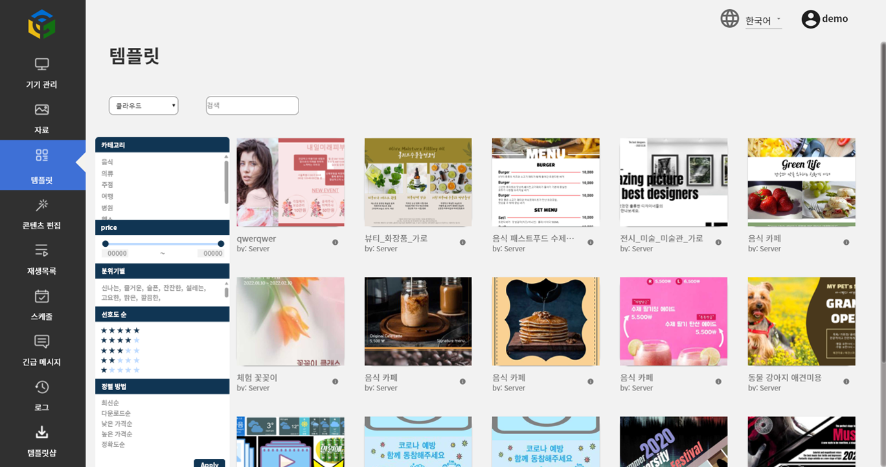

# category\_search



Request different parameters depending on the selected criteria





ex) 음식



ex) 한식



ex) 3000 | 3000, 10000



ex) 5



```python
"POST /category_search?main=음식&middle=패스트푸드&rating=1&price=3000,10000 HTTP/1.1" 200 -

"POST /category_search?main=음식&middle=패스트푸드 HTTP/1.1" 200 -

"POST /category_search?main=음식&middle=패스트푸드&rating=1 HTTP/1.1" 200 -
```


